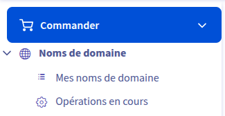

# Questions

Répondez ici aux questions théoriques en détaillant un maxium vos réponses :

1) Expliquer la procédure pour réserver un nom de domaine chez OVH avec des captures d'écran (arrêtez-vous au paiement) :

En premier lieu je me rend sur le site où je crée un compte.
J'arrive sur mon tableau de bord et je clique sur web cloud
Je clique sur nom de domaine puis je fais commander :

2. Comment faire pour qu'un nom de domaine pointe vers une adresse IP spécifique ?

Je ne peux pas vous le montrer (pas de téléphone pour valider le mot de passe), mais dans mon cas sur infomaniak je configuré depuis mon server pour qu'il pointe depuis le nom de domaine dans le tableau de bord

3. Comment mettre en place un certificat SSL ?

Pareil, dans le dashboard il y a un bouton pour activer le SSL